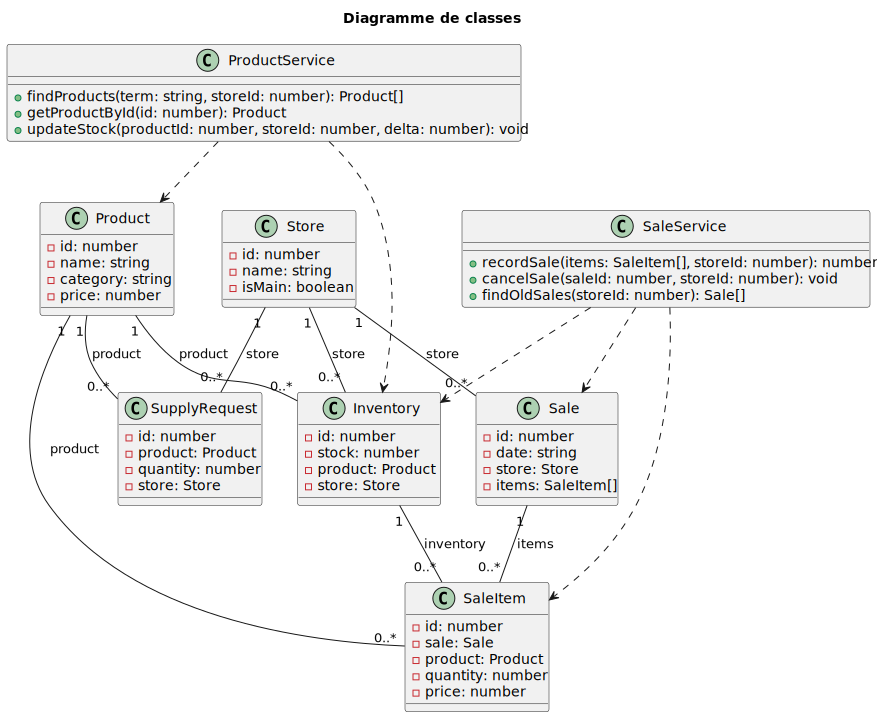
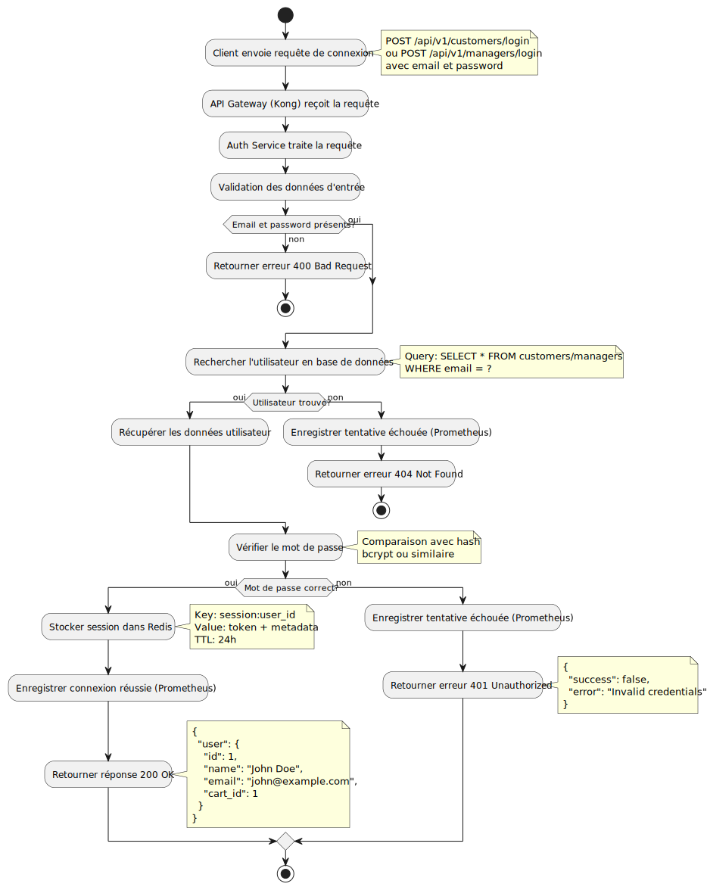
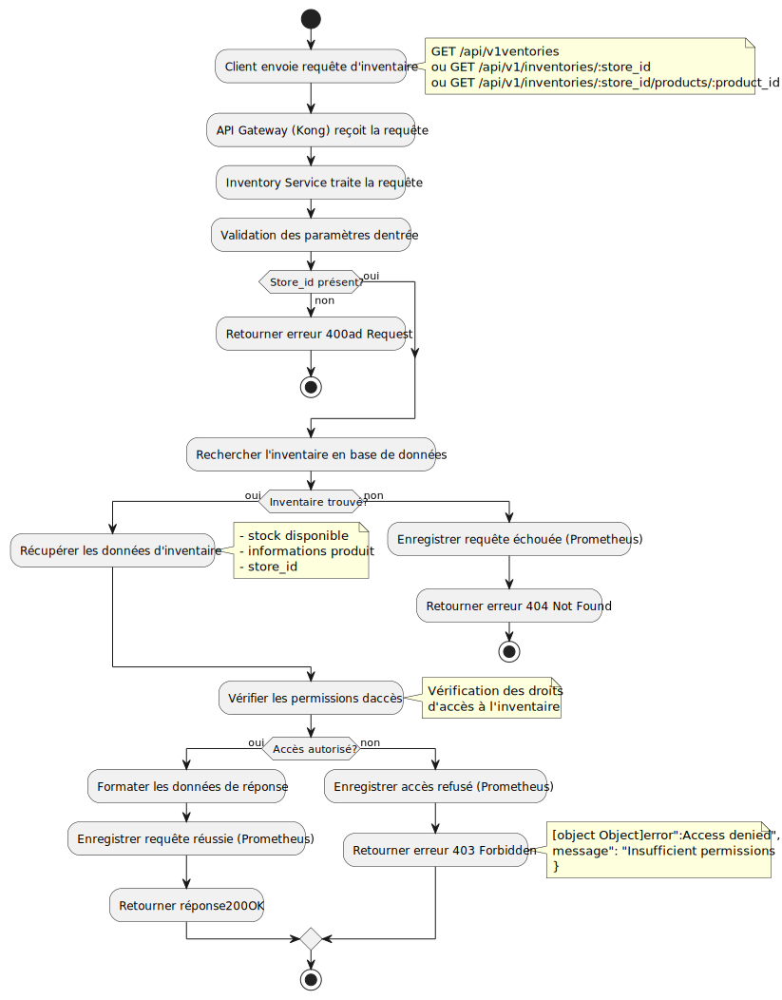
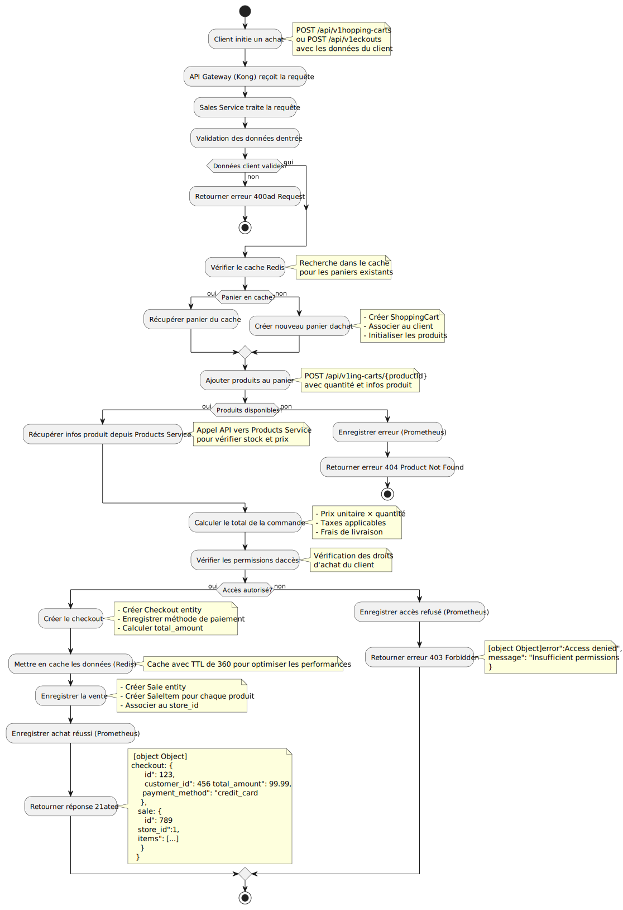
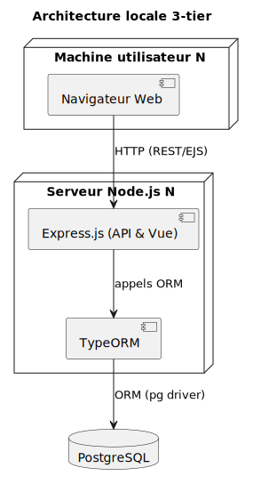
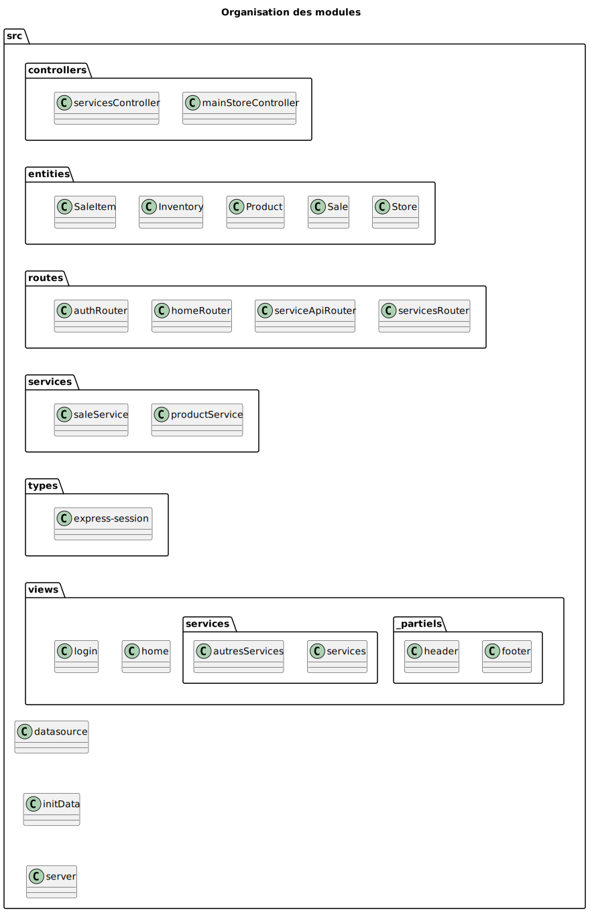
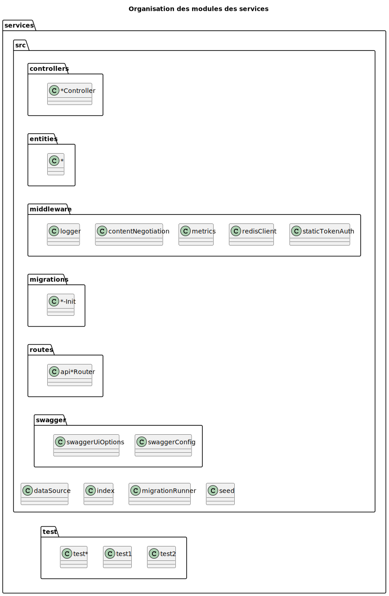
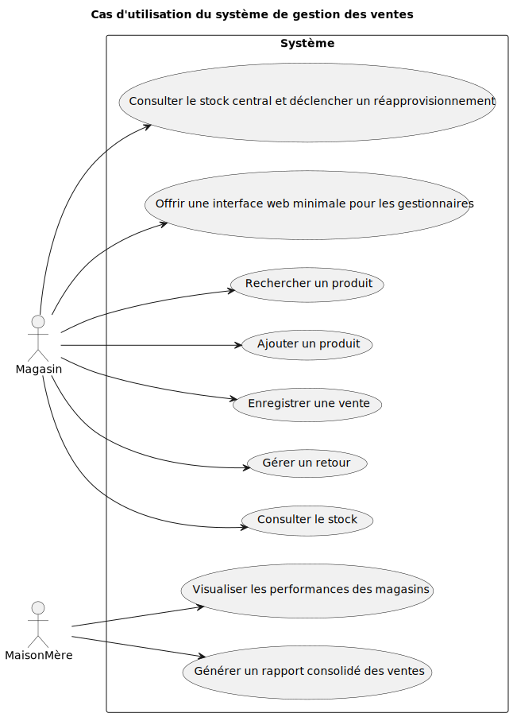

# 1. Analyse des besoins

## Besoins fonctionnels

(Labo1)

1. **Recherche de produits**  
   - Recherche par identifiant, nom ou catégorie  
2. **Enregistrement d’une vente**  
   - Sélection multiple de produits  
   - Calcul du total
3. **Gestion des retours**  
   - Annulation de vente et réintégration automatique du stock  
4. **Consultation du stock en temps réel**  
   - Affichage de la disponibilité pour chaque référence  
5. **Support multi-caisses**  
   - Jusqu’à 3 caisses concurrentes
   - Transactions atomiques pour chaque vente
6. **Couche de persistance abstraite**  
   - Accès direct à la base de données via un ORM

(Labo2)

7. **Générer un rapport consolidé des ventes**
    - La maison mère peut générer un rapport détaillé des ventes de tous les magasins et stocks
8. **Consulter le stock central et d´eclencher un réapprovisionnement**
    - Un employé voit le stock central et peux faire une demande de réapprovisionnement
9. **Visualiser les performances des magasins dans un tableau de bord**
    - La maison mère peut voir les infos des magasins sur un tableau de bord
10. **Offrir une interface web minimale pour les gestionnaires**
    - Une interface web permet de gérer le POS du magasin

---

## Besoins non-fonctionnels

| Catégorie       | Exigences clés                                                                                                                                      |
| --------------- | --------------------------------------------------------------------------------------------------------------------------------------------------- |
| **Performance** | • Temps de réponse rapide   • Gestion fluide de 3 transactions simultanées                           |
| **Fiabilité**   | • Rollback automatique en cas d’erreur                                                                                     |
| **Sécurité**    | • Validation stricte des saisies (IDs, quantités)                                              |
| **Maintenabilité** | • Séparation claire MVC   • Tests unitaires et intégration continue (CI/CD)                         |
| **Portabilité** | • Conteneurisation Docker (Dockerfile, docker-compose) pour déploiement multi-plateformes                                                            |
| **Extensibilité** | • Conception modulaire   • Architecture 4+1 pour adaptation future
| **Usabilité**   | • Interface console simple et intuitive   • Documentation complète (README, ADRs, diagrammes UML)                                                |

---

## Architecture et Technologies

- **Architecture microservices**  
  - Frontend : Application web Express.js
  - Services : auth, inventory, products, sales, store
  - API Gateway : Kong pour la gestion des routes
  - Base de données : PostgreSQL par service
- **ORM abstrait** (TypeORM)  
- **SGBD** : PostgreSQL
- **Conteneurisation** : Docker & Docker-Compose  
- **Monitoring** : Prometheus & Grafana
- **CI/CD** : GitHub Actions  
- **Tests** : Jest

---

# 2. Proposition d’architecture

## Vue logique

## Vue des processus

## Vue de déploiement

## Vue d’implémentation

## Vue des cas d'utilisation

---

# 3. Justification des d´ecisions d'architecture (ADR)

## ADR-1 : Choix de plateforme

Il faut une plateforme pour développer un système de gestion de POS avec une architecture microservices qui est modulaire, évolutive et fiable.
La plateforme choisie est Node.js avec TypeScript parce qu'on peut utiliser npm pour faciliter le développement, TypeScript est plus sécuritaire que JavaScript grâce au typage et ma connaissance de la plateforme aide le développement.

## ADR-2 : Architecture microservices

Il faut une architecture qui permet l'évolution indépendante des différents domaines métier et facilite la maintenance.
L'architecture adoptée est microservices avec séparation des responsabilités par domaine métier (auth, inventory, products, sales, store). Cela permet à chaque service d'évoluer indépendamment et facilite le déploiement et la mise à l'échelle.

## ADR-3 : Choix de mécanisme de base de données

Il faut une base de données pour gérer l'inventaire et les ventes dans un contexte multi-services.
Le type de base de données choisi est PostgreSQL avec une base de données par service (Database per Service pattern). PostgreSQL est une base de données relationnelles robuste qui supporte les transactions distribuées et facilite la gestion des données complexes.

## ADR-4 : API Gateway

Il faut un mécanisme pour gérer les communications entre le frontend et les microservices de manière centralisée.
L'API Gateway Kong est choisi pour gérer le routage, l'authentification et la limitation de débit de manière centralisée, simplifiant ainsi l'architecture et améliorant la sécurité.

## ADR-5 : Monitoring et observabilité

Il faut un système de monitoring pour surveiller les performances et la santé des microservices.
Prometheus et Grafana sont choisis pour collecter les métriques, surveiller les performances et fournir des tableaux de bord visuels pour l'observabilité du système.

# 4. Choix technologiques

## 🚀 Plateforme de développement

- **Node.js**  
  Choisi pour sa simplicité de déploiement, sa rapidité d'exécution et la richesse de son écosystème. Permet de développer des microservices performants et évolutifs.

- **TypeScript**  
  Apporte la sécurité du typage statique, facilite la maintenance et réduit les erreurs à l'exécution. Idéal pour des projets évolutifs et fiables dans un contexte microservices.

## 🗄️ Persistance des données

- **TypeORM**  
  Fournit une abstraction de la couche de persistance, simplifie l'accès aux données et compatible avec PostgreSQL. Supporte les migrations et les entités TypeScript.

- **PostgreSQL**  
  Base de données relationnelle robuste pour les applications à grande échelle. Supporte les transactions distribuées et la gestion des données complexes dans un contexte multi-services.

## 🏗️ Architecture et communication

- **Kong API Gateway**  
  Gère le routage, l'authentification et la limitation de débit de manière centralisée. Simplifie l'architecture microservices et améliore la sécurité.

- **Express.js**  
  Framework web minimaliste et flexible pour Node.js. Facilite la création d'APIs RESTful pour les microservices.

- **Swagger/OpenAPI**  
  Documentation automatique des APIs pour chaque microservice. Améliore la collaboration entre équipes et facilite l'intégration.

## 🐳 Conteneurisation et déploiement

- **Docker & Docker Compose**  
  Garantissent la portabilité et la reproductibilité de l'environnement de développement et de production. Simplifient le déploiement des microservices sur différentes plateformes.

- **Nginx**  
  Serveur web et reverse proxy pour servir l'application frontend et gérer les requêtes statiques.

## 📊 Monitoring et observabilité

- **Prometheus**  
  Système de collecte et de stockage de métriques pour surveiller les performances des microservices.

- **Grafana**  
  Plateforme de visualisation et de création de tableaux de bord pour analyser les métriques collectées par Prometheus.

## 🧪 Tests et qualité

- **Jest**  
  Outil de tests unitaires moderne, rapide et facile à intégrer dans un projet TypeScript. Permet d'assurer la fiabilité du code et de faciliter la maintenance.

- **ESLint**  
  Outil d'analyse statique pour maintenir la qualité du code et respecter les standards de codage.

## 🔄 Intégration continue

- **GitHub Actions**  
  Automatise les tests, la vérification de qualité du code et le déploiement à chaque modification du code, augmentant la fiabilité et la qualité du projet.
