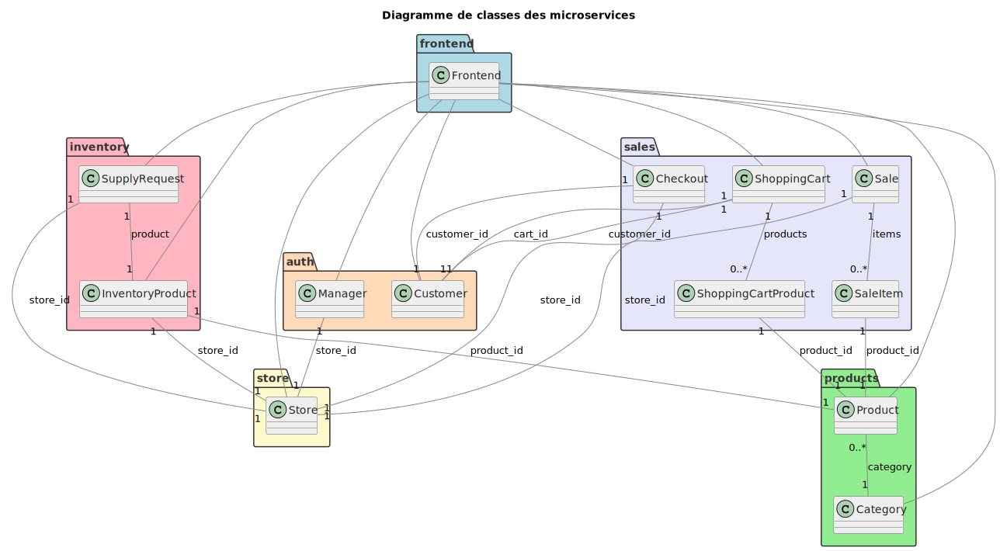
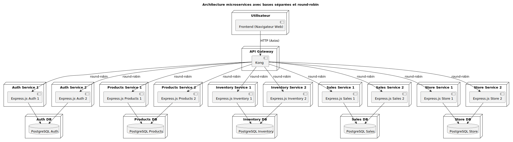
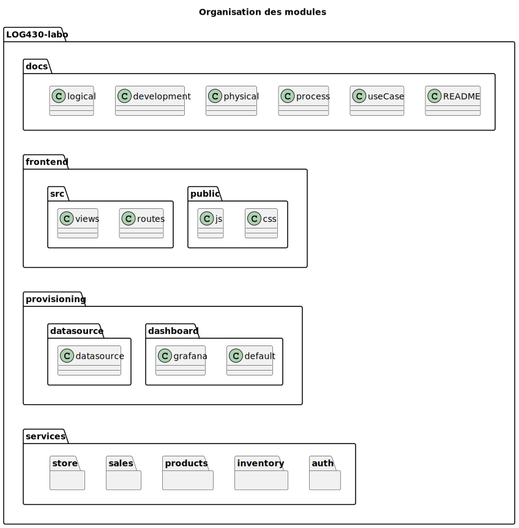

# 1. Analyse des besoins

## Besoins fonctionnels

1. **Recherche de produits**  
   - Recherche par identifiant, nom ou catégorie  
2. **Enregistrement d’une vente**  
   - Sélection multiple de produits  
   - Calcul du total
3. **Gestion des retours**  
   - Annulation de vente et réintégration automatique du stock  
4. **Consultation du stock en temps réel**  
   - Affichage de la disponibilité pour chaque référence  
5. **Support multi-caisses**  
   - Jusqu’à 3 caisses concurrentes
   - Transactions atomiques pour chaque vente
6. **Couche de persistance abstraite**  
   - Accès direct à la base de données via un ORM

---

## Besoins non-fonctionnels

| Catégorie       | Exigences clés                                                                                                                                      |
| --------------- | --------------------------------------------------------------------------------------------------------------------------------------------------- |
| **Performance** | • Temps de réponse rapide   • Gestion fluide de 3 transactions simultanées                           |
| **Fiabilité**   | • Rollback automatique en cas d’erreur                                                                                     |
| **Sécurité**    | • Validation stricte des saisies (IDs, quantités)                                              |
| **Maintenabilité** | • Séparation claire MVC   • Tests unitaires et intégration continue (CI/CD)                         |
| **Portabilité** | • Conteneurisation Docker (Dockerfile, docker-compose) pour déploiement multi-plateformes                                                            |
| **Extensibilité** | • Conception modulaire   • Architecture 4+1 pour adaptation future
| **Usabilité**   | • Interface console simple et intuitive   • Documentation complète (README, ADRs, diagrammes UML)                                                |

---

## Architecture et Technologies

- **Client/Serveur 2 tiers**  
  - Interface : application console légère  
  - Serveur : couche métier + persistance  
- **ORM abstrait** (TypeORM)  
- **SGBD** : SQLite
- **Conteneurisation** : Docker & Docker-Compose  
- **CI/CD** : GitHub Actions / GitLab CI  
- **Tests** : Jest

---

# 2. Proposition d’architecture

## Vue logique

## Vue des processus (cas d’utilisation)

## Vue de déploiement

## Vue d’implémentation

---

# 3. Justification des d´ecisions d’architecture (ADR)

## ADR-1 : Choix de plateform

Il faut une plateforme pour faire une service de gestion de POS avec un modèle 2-tier qui est modulaire et fiable.
La plateforme choisit est Node.js avec TypeScript parce qu'on peut utiliser npm pour facilité le développement, TypeScript est plus sécuriataire que JavaScript grâce au typage et ma connaissance de la plateforme aide le développement.

## ADR-2 : Séparation des responsabilités

Il faut une structure claire pour maintenir une évolution de l'application et séparer les différentes couches de l'application.
L'architecture adopté est inspiré des celle Modèle-Vue-Contrôleur (MVC). Cela fait en sorte que chaques couches sont séparées des autres et elles peuvent évoluer indépendamment.

## ADR-3 : Choix de m´ecanisme de base de données

Il faut une base de données pour gérer l'inventaire et les ventes.
Le type de base de données choisit est SQLite parce que c'est léger, sans serveur et facile à utiliser avec Node.js. Permet d'utiliser TypeORM facilement pour l’abstraction de la couche de persistance.

# 4. Choix technologiques

- **Node.js**  
  Choisi pour sa simplicité de déploiement, sa rapidité d’exécution et la richesse de son écosystème. Permet de développer une application console portable et légère.

- **TypeScript**  
  Apporte la sécurité du typage statique, facilite la maintenance et réduit les erreurs à l’exécution. Idéal pour des projets évolutifs et fiables.

- **TypeORM**  
  Fournit une abstraction de la couche de persistance, simplifie l’accès aux données et compatible avec SQLite.

- **SQLite**  
  Base de données légère, sans serveur, parfaitement adapté à une application locale. Facile à sauvegarder, déployer et ne nécessite aucune configuration complexe.

- **Jest**  
  Outil de tests unitaires moderne, rapide et facile à intégrer dans un projet TypeScript. Permet d’assurer la fiabilité du code et de faciliter la maintenance.

- **Docker & Docker Compose**  
  Garantissent la portabilité et la reproductibilité de l’environnement de développement et de production. Simplifient le déploiement sur différentes plateformes sans configuration manuelle.

- **GitHub Actions / GitLab CI**  
  Intègrent l’intégration continue (CI) pour automatiser les tests et les vérifications à chaque modification du code, augmentant la fiabilité et la qualité du projet.
