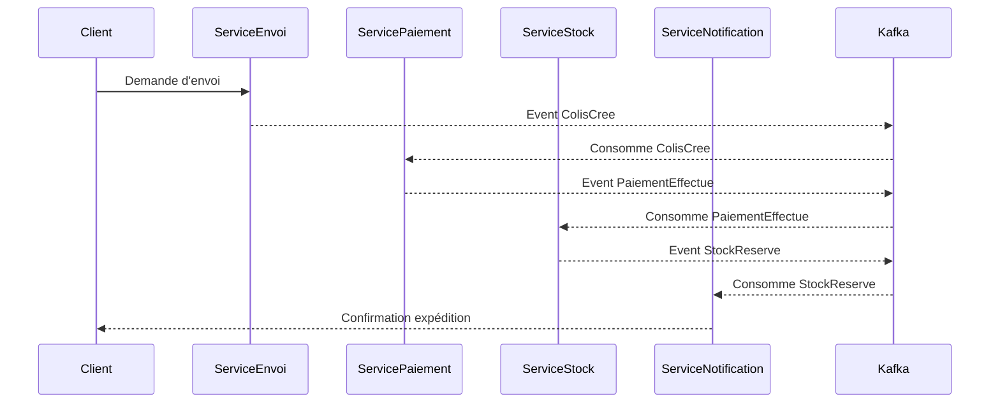

# Labo 7 – Architecture Événementielle, CQRS et Saga Chorégraphiée

## 1. Scénario métier retenu

Scénario choisi : **Suivi de colis** dans un contexte e-commerce.

Le flux métier couvre le cycle complet du colis :
1. **Enregistrement d’un envoi** – création de l’expédition par le service logistique.
2. **Expédition** – colis remis au transporteur.
3. **Livraison** – colis livré au client.
4. **Gestion d’incident** – perte ou dommage signalé.

### Événements principaux
- `ColisCree`
- `ColisExpedie`
- `ColisLivre`
- `IncidentDeclare`
- `IncidentResolue`

---

## 2. Architecture Événementielle (Pub/Sub, Event Store, CQRS)

**Technologies envisagées :**
- **Broker** : Apache Kafka  
- **Event Store** : PostgreSQL pour persistance  
- **CQRS** :
  - **Command Side** : services métier publiant les événements après validation.
  - **Query Side** : projections dans PostgreSQL + cache Redis.

---

## 3. Diagramme de séquence – Saga Chorégraphiée (succès)



---

## 4. ADR (Architectural Decision Records)

### ADR 1 – Utilisation d’une Saga Chorégraphiée
- **Contexte** : Processus multi-services nécessitant résilience et découplage.
- **Décision** : Chaque service réagit aux événements du précédent sans orchestrateur central.
- **Conséquences** :
  - Flexibilité et tolérance aux pannes accrues.
  - Logique distribuée plus complexe à suivre.

### ADR 2 – Event Store persistant avec PostgreSQL + projections CQRS
- **Contexte** : Besoin de traçabilité et de relecture complète.
- **Décision** : Stocker tous les événements dans PostgreSQL et générer des vues de lecture.
- **Conséquences** :
  - Historique complet disponible.
  - Gestion plus complexe de la synchronisation.

---

## 5. Événements et compensation (exemples)

### Succès
```json
{
  "type": "ColisLivre",
  "timestamp": "2025-08-05T14:32:00Z",
  "payload": {
    "colisId": "12345",
    "clientId": "C987",
    "adresse": "123 rue Principale, Montréal"
  }
}
```

### Compensation (paiement échoué après réservation stock)
```json
{
  "type": "AnnulationStock",
  "timestamp": "2025-08-05T14:34:00Z",
  "payload": {
    "colisId": "12345",
    "raison": "Paiement refusé"
  }
}
```

---

## 6. Logs significatifs (format JSON)

```json
{
  "level": "INFO",
  "service": "ServicePaiement",
  "event": "PaiementEffectue",
  "correlationId": "abc-123",
  "durationMs": 152
}
```

---

## 7. Observabilité

### Métriques Prometheus
- `events_produced_total` (par service)
- `events_consumed_total`
- `saga_success_total` / `saga_failure_total`
- `event_latency_ms` (p95, p99)

### Dashboards Grafana
- Vue globale des événements par topic Kafka.
- Taux de succès/échec des sagas.
- Latence moyenne par événement.
