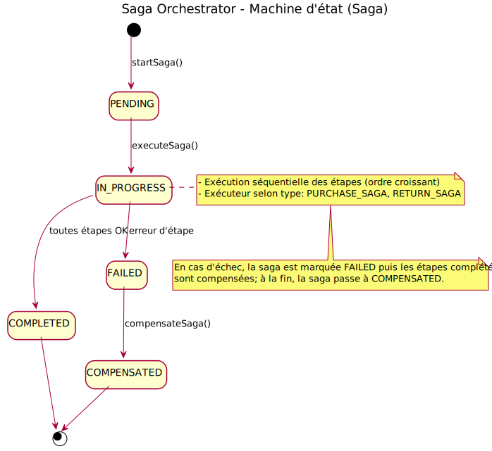
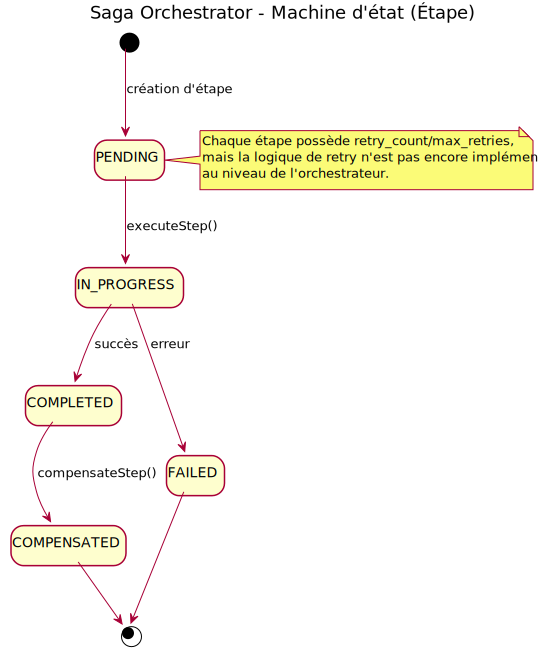
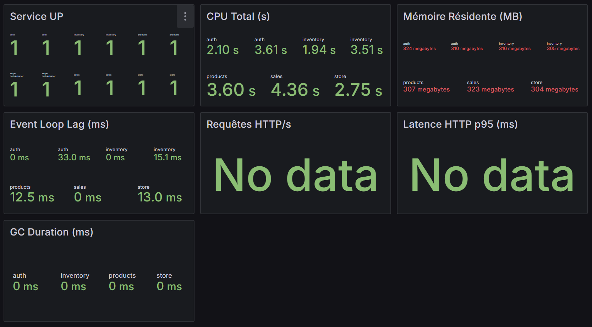
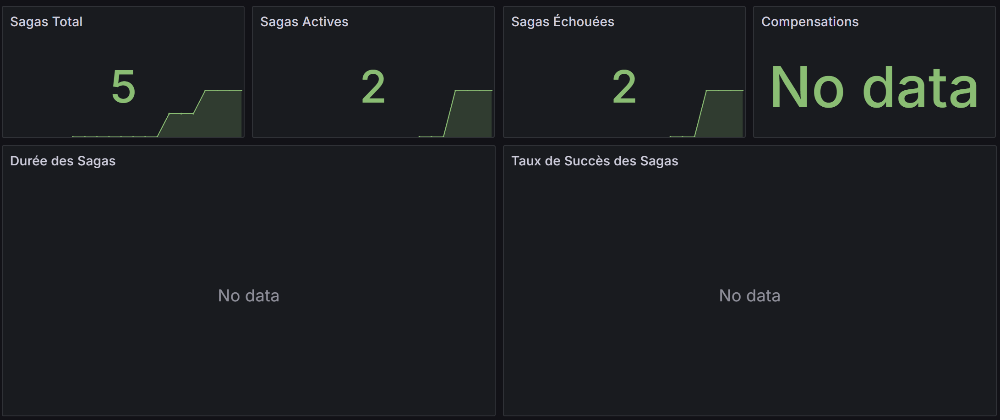

# Saga Orchestrator – Rapport Technique

## 1. Scénario métier et saga implémentée

Le service **`saga-orchestrator`** gère l’orchestration de **transactions distribuées** dans des processus métier critiques impliquant plusieurs microservices.

Deux scénarios principaux sont implémentés :

### **1.1 Purchase Saga**
Objectif : Orchestrer l’achat d’un produit en garantissant la cohérence entre services.  
Étapes :
1. Réservation de stock
2. Paiement
3. Confirmation de vente

**Compensations associées** :
- Si le paiement échoue → Annuler la réservation de stock
- Si la confirmation échoue → Annuler le paiement + libérer le stock

---

### **1.2 Return Saga**
Objectif : Orchestrer le retour d’un produit et assurer un remboursement correct.  
Étapes :
1. Validation du retour
2. Remboursement
3. Mise à jour du stock

**Compensations associées** :
- Si la mise à jour du stock échoue → Annuler le remboursement
- Si la validation échoue → Stopper la saga immédiatement

---

## 2. Diagrammes de la machine d’état




---

## 3. Décisions d’architecture (ADR)

### **ADR 1 – Utilisation du pattern Saga Orchestrator**
**Contexte** :  
Les processus métier impliquent plusieurs microservices indépendants, nécessitant une coordination fiable et tolérante aux pannes.

**Décision** :  
Mettre en place un **Saga Orchestrator centralisé** pour gérer :
- Les transitions entre étapes
- Les compensations automatiques
- La persistance des états

**Conséquences** :
- Visibilité accrue sur l’état global des transactions
- Capacité à annuler partiellement une transaction en cas d’échec
- Complexité accrue de l’orchestrateur, mais simplification pour les microservices participants

---

### **ADR 2 – Stockage en base relationnelle + cache Redis**
**Contexte** :  
Les sagas doivent être **persistées** pour permettre la reprise après incident. Le traitement simultané de nombreuses sagas nécessite de hautes performances.

**Décision** :
- Utiliser **PostgreSQL/MySQL** pour la persistance fiable des données
- Utiliser **Redis** pour le cache et la gestion de concurrence

**Conséquences** :
- Données fiables et durables
- Réduction de la latence lors des transitions d’étapes
- Mise en place d’une stratégie de synchronisation entre Redis et la base relationnelle

---

## 4. Mécanismes de compensation

Chaque étape de saga implémente une **fonction de compensation** qui est déclenchée si une étape ultérieure échoue.

**Exemples concrets** :
- **Réservation de stock** → Annulée si le paiement échoue
- **Remboursement** → Annulé si la mise à jour du stock échoue
- **Confirmation de vente** → Annulation du paiement et libération du stock si échec

**Avantages** :
- Cohérence garantie même en cas d’échec partiel
- Automatisation de la gestion d’erreurs

---

## 5. Captures d’écran des dashboards





---

## 6. Structure du projet

```bash
saga-orchestrator/
├── logs/
├── src/
│   ├── controllers/       
│   ├── entities/
│   ├── middleware/
│   ├── migrations/
│   ├── routes/
│   ├── services/
│   ├── swagger/
│   ├── data-source.ts
│   ├── index.ts
│   ├── migration-runner.ts
│   └── seed.ts
├── test/
├── types/
├── .env
├── Dockerfile
└── package.json