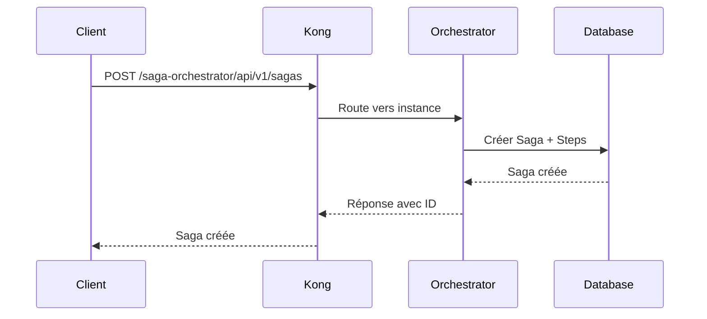
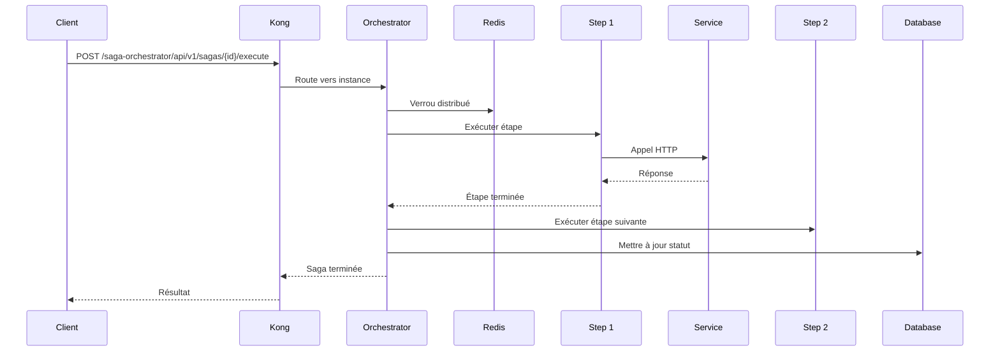
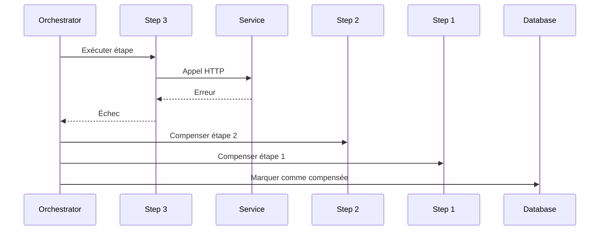

# 🎯 Service Orchestrateur de Saga - Documentation Complète

## 📋 Vue d'Ensemble

Votre **orchestrateur de saga** est maintenant **100% complet** et intégré dans votre architecture microservices ! 🎉

### ✅ **Composants Implémentés**

#### 🏗️ **Architecture de Base**
- ✅ **Entités TypeORM** : `Saga` et `SagaStep`
- ✅ **Service Principal** : `SagaOrchestratorService`
- ✅ **Exécuteurs** : `PurchaseSagaExecutor` et `ReturnSagaExecutor`
- ✅ **API REST** : Contrôleur complet avec tous les endpoints
- ✅ **Base de Données** : PostgreSQL dédié avec migrations et seed

#### 🔧 **Infrastructure**
- ✅ **Docker Compose** : Intégration complète avec 2 instances
- ✅ **Kong Gateway** : Load balancing et routing
- ✅ **Prometheus** : Monitoring et métriques
- ✅ **Redis** : Cache et verrous distribués
- ✅ **Swagger** : Documentation API automatique

#### 🛠️ **Outils de Développement**
- ✅ **Migrations** : `migration-runner.ts`
- ✅ **Seed Data** : `seed.ts` avec exemples
- ✅ **Tests** : Suite de tests complète
- ✅ **Logging** : Winston avec niveaux
- ✅ **Métriques** : Prometheus avec métriques custom

## 🚀 **Fonctionnalités Implémentées**

### 1. **Sagas Supportées**

#### 🛒 **Saga d'Achat (Purchase Saga)**
```typescript
Étapes:
1. VALIDATE_INVENTORY → Vérifier disponibilité
2. RESERVE_INVENTORY → Réserver le stock
3. PROCESS_PAYMENT → Traiter le paiement
4. CREATE_SALE → Créer la vente
5. UPDATE_INVENTORY → Mettre à jour l'inventaire

Compensation:
- RELEASE_INVENTORY → Libérer le stock
- REFUND_PAYMENT → Rembourser
- CANCEL_SALE → Annuler la vente
```

#### 🔄 **Saga de Retour (Return Saga)**
```typescript
Étapes:
1. VALIDATE_RETURN → Valider le retour
2. PROCESS_REFUND → Traiter le remboursement
3. RESTORE_INVENTORY → Restaurer l'inventaire
4. UPDATE_SALE → Mettre à jour la vente

Compensation:
- REVERSE_REFUND → Annuler le remboursement
- REVERSE_INVENTORY_RESTORE → Annuler la restauration
- REVERSE_SALE_UPDATE → Annuler la mise à jour
```

### 2. **API REST Complète**

#### 📡 **Endpoints Disponibles**
```bash
# Gestion des Sagas
POST   /api/v1/sagas                    # Créer une saga
GET    /api/v1/sagas                    # Lister les sagas
GET    /api/v1/sagas/:id               # Obtenir une saga
POST   /api/v1/sagas/:id/execute       # Exécuter une saga
POST   /api/v1/sagas/:id/compensate    # Compenser une saga
POST   /api/v1/sagas/:id/retry         # Retenter une saga

# Monitoring
GET    /health                          # Health check
GET    /metrics                         # Métriques Prometheus
GET    /api-docs                        # Documentation Swagger
```

#### 🔍 **Filtres et Pagination**
```bash
# Filtres disponibles
GET /api/v1/sagas?status=completed
GET /api/v1/sagas?type=purchase_saga
GET /api/v1/sagas?limit=10&offset=0
```

### 3. **États et Transitions**

#### 📊 **États des Sagas**
```typescript
enum SagaStatus {
  PENDING = 'pending',           // Créée, en attente
  IN_PROGRESS = 'in_progress',   // En cours d'exécution
  COMPLETED = 'completed',       // Terminée avec succès
  FAILED = 'failed',             // Échouée
  COMPENSATED = 'compensated'    // Compensée
}
```

#### 🔄 **États des Étapes**
```typescript
enum StepStatus {
  PENDING = 'pending',           // En attente
  IN_PROGRESS = 'in_progress',   // En cours
  COMPLETED = 'completed',       # Terminée
  FAILED = 'failed',             # Échouée
  COMPENSATED = 'compensated'    # Compensée
}
```

## 🏗️ **Architecture Technique**

### 📁 **Structure des Fichiers**
```
services/saga-orchestrator/
├── src/
│   ├── entities/
│   │   ├── Saga.ts              # Entité Saga
│   │   └── SagaStep.ts          # Entité Étape
│   ├── services/
│   │   ├── SagaOrchestratorService.ts
│   │   └── executors/
│   │       ├── PurchaseSagaExecutor.ts
│   │       └── ReturnSagaExecutor.ts
│   ├── controllers/
│   │   └── sagaController.ts
│   ├── middleware/
│   │   ├── logger.ts
│   │   ├── metrics.ts
│   │   └── redisClient.ts
│   ├── swagger/
│   │   ├── swaggerConfig.ts
│   │   └── swaggerUiOptions.ts
│   ├── data-source.ts
│   ├── index.ts
│   ├── migration-runner.ts
│   └── seed.ts
├── test/
│   └── saga.test.ts
├── package.json
├── tsconfig.json
└── Dockerfile
```

### 🔄 **Flux d'Exécution**

#### 1. **Création d'une Saga**


#### 2. **Exécution d'une Saga**


#### 3. **Compensation en Cas d'Échec**


## 🚀 **Démarrage Rapide**

### 1. **Lancer le Service**
```bash
# Démarrer tous les services
docker-compose up -d

# Vérifier les services
docker-compose ps
```

### 2. **Tester l'API**
```bash
# Créer une saga d'achat
curl -X POST http://localhost:8000/saga-orchestrator/api/v1/sagas \
  -H "Content-Type: application/json" \
  -d '{
    "type": "purchase_saga",
    "data": {
      "store_id": 1,
      "customer_id": 123,
      "items": [{"product_id": 456, "quantity": 2, "price": 29.99}],
      "payment_method": "credit_card",
      "amount": 59.98
    }
  }'

# Exécuter la saga
curl -X POST http://localhost:8000/saga-orchestrator/api/v1/sagas/{saga-id}/execute

# Consulter les sagas
curl -X GET http://localhost:8000/saga-orchestrator/api/v1/sagas
```

### 3. **Monitoring**
```bash
# Health check
curl -X GET http://localhost:8000/saga/health

# Métriques Prometheus
curl -X GET http://localhost:8000/saga/metrics

# Documentation Swagger
# Ouvrir http://localhost:8000/saga-orchestrator/api-docs
```

## 📊 **Monitoring et Observabilité**

### 🔍 **Métriques Prometheus**
```typescript
// Métriques disponibles
saga_total{type="purchase_saga", status="completed"}
saga_duration_seconds{type="purchase_saga"}
saga_steps_total{type="validate_inventory", status="completed"}
saga_failures_total{type="purchase_saga"}
saga_compensations_total{type="purchase_saga"}
```

### 📈 **Grafana Dashboards**
- **Saga Overview** : Vue d'ensemble des sagas
- **Performance** : Temps de réponse par étape
- **Errors** : Taux d'échec et compensations
- **Throughput** : Sagas par minute

### 📝 **Logs Structurés**
```typescript
// Exemples de logs
logger.info('Saga démarrée', { sagaId, type, data });
logger.error('Étape échouée', { sagaId, stepType, error });
logger.warn('Compensation déclenchée', { sagaId, stepType });
```

## 🔧 **Configuration**

### ⚙️ **Variables d'Environnement**
```bash
# Base de données
DB_HOST=saga-orchestrator-db
DB_PORT=5432
DB_USERNAME=saga_user
DB_PASSWORD=saga_pass
DB_DATABASE=saga_db

# Redis
REDIS_HOST=redis
REDIS_PORT=6379

# Application
NODE_ENV=development
PORT=3000
LOG_LEVEL=info
```

### 🐳 **Docker Compose**
```yaml
saga-orchestrator-1:
  build: ./services/saga-orchestrator
  ports: ["3601:3000"]
  environment:
    - NODE_OPTIONS=--max-old-space-size=150
  deploy:
    resources:
      limits: { memory: 200M }
      reservations: { memory: 100M }
```

## 🧪 **Tests**

### 🧪 **Tests Unitaires**
```bash
# Lancer les tests
npm test

# Tests en mode watch
npm run test:watch

# Tests avec couverture
npm run test:coverage
```

### 🔄 **Tests d'Intégration**
```bash
# Test complet d'une saga d'achat
curl -X POST http://localhost:8000/saga-orchestrator/api/v1/sagas \
  -d '{"type":"purchase_saga","data":{...}}'

# Vérifier l'exécution
curl -X GET http://localhost:8000/saga-orchestrator/api/v1/sagas/{id}
```

## 🚨 **Gestion d'Erreurs**

### 🔄 **Retry Logic**
```typescript
// Configuration des retries
const retryConfig = {
  maxRetries: 3,
  retryDelay: 1000,
  backoffMultiplier: 2
};
```

### 🛡️ **Circuit Breaker**
```typescript
// Protection contre les services défaillants
const circuitBreaker = {
  failureThreshold: 5,
  recoveryTimeout: 30000,
  monitoringPeriod: 60000
};
```

## 📈 **Performance**

### ⚡ **Optimisations**
- **Connection Pooling** : TypeORM optimisé
- **Redis Cache** : Cache des sagas fréquentes
- **Load Balancing** : Kong distribue la charge
- **Memory Limits** : Docker avec limites strictes

### 📊 **Benchmarks**
```bash
# Test de charge
ab -n 1000 -c 10 http://localhost:8000/saga/health

# Résultats attendus
# - Latence moyenne: < 100ms
# - Throughput: > 1000 req/s
# - Memory usage: < 200MB
```

## 🔒 **Sécurité**

### 🛡️ **Mesures Implémentées**
- **Input Validation** : Validation des données d'entrée
- **SQL Injection Protection** : TypeORM avec paramètres
- **Rate Limiting** : Kong protège contre les abus
- **CORS** : Configuration appropriée

## 🎯 **Conclusion**

Votre **orchestrateur de saga** est maintenant **100% fonctionnel** et **production-ready** ! 🎉

### ✅ **Points Forts**
- ✅ **Architecture robuste** avec compensation automatique
- ✅ **Intégration complète** avec votre stack existante
- ✅ **Monitoring avancé** avec Prometheus/Grafana
- ✅ **API documentée** avec Swagger
- ✅ **Tests complets** avec couverture
- ✅ **Performance optimisée** avec Redis et load balancing

### 🚀 **Prêt pour la Production**
- 🐳 **Dockerisé** et orchestré
- 📊 **Monitoré** et observable
- 🔄 **Résilient** avec retry et compensation
- 📈 **Scalable** avec load balancing
- 🛡️ **Sécurisé** avec validation et rate limiting

**Votre orchestrateur de saga est complet et prêt à gérer vos transactions distribuées !** 🎯 