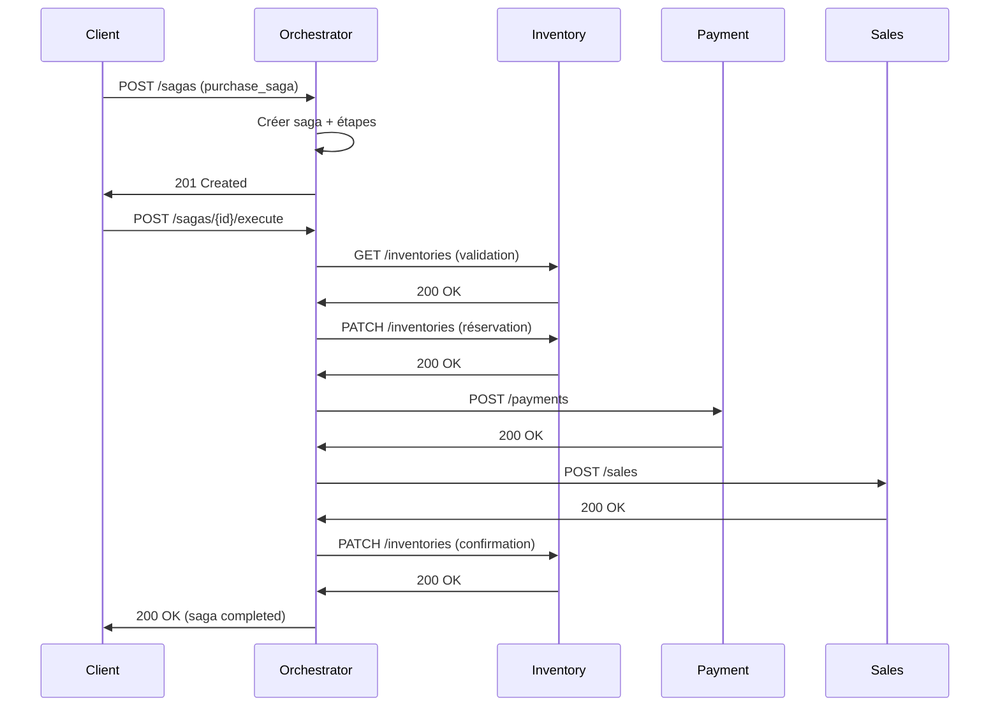
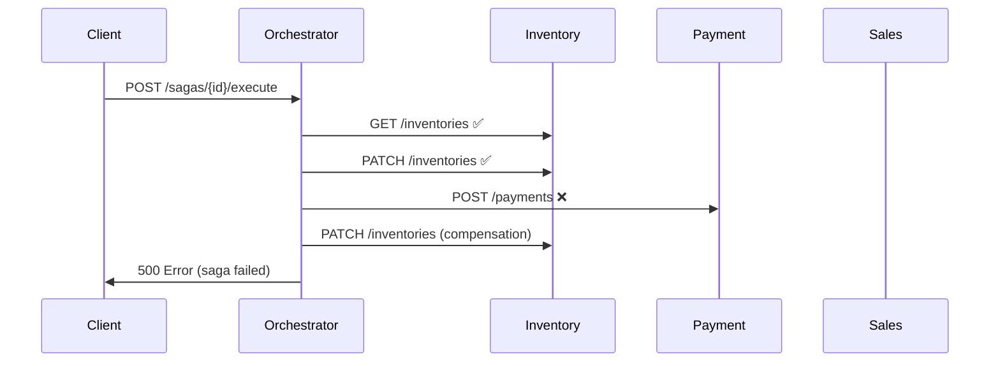

# Service Orchestrateur de Saga - Documentation

## Vue d'ensemble

Le service orchestrateur de saga est un composant central qui gère les transactions distribuées de manière synchrone dans l'architecture microservices. Il assure la cohérence des données en orchestrant les étapes d'une transaction et en gérant les compensations en cas d'échec.

## Architecture

### Composants Principaux

1. **SagaOrchestratorService** : Service principal d'orchestration
2. **SagaExecutor** : Exécuteurs spécifiques pour chaque type de saga
3. **Saga & SagaStep** : Entités de persistance pour le suivi
4. **SagaController** : API REST pour la gestion des sagas

### Types de Saga Supportés

- **PURCHASE_SAGA** : Gestion complète d'un achat (validation → réservation → paiement → vente → mise à jour)
- **RETURN_SAGA** : Gestion d'un retour (validation → remboursement → restauration → mise à jour)
- **INVENTORY_UPDATE_SAGA** : Mise à jour d'inventaire
- **PAYMENT_SAGA** : Gestion des paiements

## API Endpoints

### 1. Démarrer une Saga

```http
POST /api/v1/sagas
Content-Type: application/json

{
  "type": "purchase_saga",
  "data": {
    "store_id": 1,
    "customer_id": 123,
    "items": [
      {
        "product_id": 456,
        "quantity": 2,
        "price": 29.99
      }
    ],
    "payment_method": "credit_card",
    "amount": 59.98
  }
}
```

**Réponse :**
```json
{
  "message": "Saga démarrée avec succès",
  "saga": {
    "id": "uuid-saga-id",
    "type": "purchase_saga",
    "status": "pending",
    "created_at": "2024-01-15T10:30:00Z"
  }
}
```

### 2. Exécuter une Saga

```http
POST /api/v1/sagas/{sagaId}/execute
```

**Réponse :**
```json
{
  "message": "Saga exécutée avec succès",
  "saga": {
    "id": "uuid-saga-id",
    "type": "purchase_saga",
    "status": "completed",
    "completed_at": "2024-01-15T10:31:00Z",
    "steps": [
      {
        "id": "step-uuid-1",
        "type": "validate_inventory",
        "status": "completed",
        "step_order": 1,
        "started_at": "2024-01-15T10:30:30Z",
        "completed_at": "2024-01-15T10:30:35Z"
      }
    ]
  }
}
```

### 3. Récupérer une Saga

```http
GET /api/v1/sagas/{sagaId}
```

### 4. Lister toutes les Sagas

```http
GET /api/v1/sagas?status=completed&type=purchase_saga&limit=10&offset=0
```

### 5. Compenser une Saga

```http
POST /api/v1/sagas/{sagaId}/compensate
```

### 6. Retenter une Saga

```http
POST /api/v1/sagas/{sagaId}/retry
```

## Flux d'Exécution

### Saga d'Achat (PURCHASE_SAGA)



### Gestion des Erreurs et Compensation



## États des Sagas

| État | Description |
|------|-------------|
| `pending` | Saga créée, en attente d'exécution |
| `in_progress` | Saga en cours d'exécution |
| `completed` | Saga terminée avec succès |
| `failed` | Saga échouée |
| `compensated` | Saga compensée après échec |

## États des Étapes

| État | Description |
|------|-------------|
| `pending` | Étape en attente |
| `in_progress` | Étape en cours d'exécution |
| `completed` | Étape terminée avec succès |
| `failed` | Étape échouée |
| `compensated` | Étape compensée |

## Configuration

### Variables d'Environnement

```env
# Base de données
DB_HOST=saga-orchestrator-db
DB_PORT=5432
DB_USER=saga_user
DB_PASSWORD=saga_pass
DB_NAME=saga_db

# Redis
REDIS_HOST=redis
REDIS_PORT=6379

# Logs
LOG_LEVEL=info

# Métriques
METRICS_PORT=9090

# Timeouts
STEP_TIMEOUT=30000
SAGA_TIMEOUT=300000
```

### Optimisations Mémoire

- **Limite mémoire** : 200MB par instance
- **Heap Node.js** : 150MB maximum
- **Pool de connexions** : 5 connexions DB
- **Cache Redis** : TTL de 5 minutes

## Monitoring et Observabilité

### Métriques Prometheus

- `saga_total` : Nombre total de sagas
- `saga_duration_seconds` : Durée d'exécution des sagas
- `saga_steps_total` : Nombre d'étapes par saga
- `saga_failures_total` : Nombre d'échecs de saga
- `saga_compensations_total` : Nombre de compensations

### Logs Structurés

```json
{
  "level": "info",
  "message": "Saga démarrée",
  "saga_id": "uuid-saga-id",
  "saga_type": "purchase_saga",
  "timestamp": "2024-01-15T10:30:00Z"
}
```

## Sécurité

### Authentification

- **API Gateway** : Kong gère l'authentification
- **Rate Limiting** : Limitation des requêtes par client
- **CORS** : Configuration restrictive en production

### Validation des Données

```typescript
// Validation des données d'entrée
const schema = {
  type: 'object',
  properties: {
    type: { enum: Object.values(SagaType) },
    data: { type: 'object' }
  },
  required: ['type', 'data']
};
```

## Tests

### Tests Unitaires

```bash
npm test
```

### Tests d'Intégration

```bash
npm run test:integration
```

### Tests de Performance

```bash
npm run test:load
```

## Déploiement

### Docker Compose

```yaml
saga-orchestrator-1:
  build: ./services/saga-orchestrator
  ports:
    - "3601:3000"
  environment:
    - NODE_OPTIONS=--max-old-space-size=150
  deploy:
    resources:
      limits:
        memory: 200M
```

### Kubernetes

```yaml
apiVersion: apps/v1
kind: Deployment
metadata:
  name: saga-orchestrator
spec:
  replicas: 2
  selector:
    matchLabels:
      app: saga-orchestrator
  template:
    metadata:
      labels:
        app: saga-orchestrator
    spec:
      containers:
      - name: saga-orchestrator
        image: saga-orchestrator:latest
        ports:
        - containerPort: 3000
        resources:
          limits:
            memory: "200Mi"
            cpu: "500m"
```

## Bonnes Pratiques

### 1. Idempempotence

Toutes les étapes doivent être idempotentes pour permettre les retentatives.

### 2. Timeouts

Définir des timeouts appropriés pour chaque étape et la saga complète.

### 3. Retry Logic

Implémenter une logique de retry avec backoff exponentiel.

### 4. Monitoring

Surveiller les métriques de performance et les erreurs.

### 5. Logging

Logger toutes les actions importantes pour le debugging.

## Troubleshooting

### Problèmes Courants

1. **Saga bloquée en `in_progress`**
   - Vérifier les logs de l'étape en cours
   - Forcer la compensation si nécessaire

2. **Échec de compensation**
   - Vérifier la connectivité avec les services
   - Implémenter des compensations manuelles

3. **Performance dégradée**
   - Vérifier l'utilisation mémoire
   - Optimiser les requêtes DB
   - Augmenter les ressources

### Commandes de Debug

```bash
# Vérifier l'état d'une saga
curl http://localhost:3601/api/v1/sagas/{sagaId}

# Forcer la compensation
curl -X POST http://localhost:3601/api/v1/sagas/{sagaId}/compensate

# Retenter une saga
curl -X POST http://localhost:3601/api/v1/sagas/{sagaId}/retry
```

## Évolutions Futures

1. **Sagas Asynchrones** : Support des sagas asynchrones
2. **Sagas Distribuées** : Orchestration distribuée
3. **Event Sourcing** : Stockage des événements de saga
4. **CQRS** : Séparation lecture/écriture
5. **Sagas Choreographées** : Communication directe entre services 